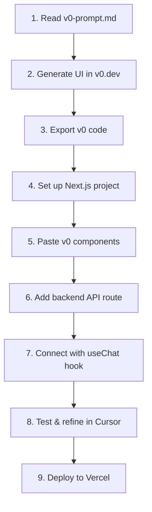

# 🌟 LoneSomeNoMore - Web Version Setup

Welcome! This guide will help you transform your beautiful CLI chat interface into a stunning web application.

## 📚 Documentation Overview

You now have everything you need to build the web version:

| Document | Purpose | When to Use |
|----------|---------|-------------|
| **v0-prompt.md** | Pre-written prompt for v0.dev | 🟢 **START HERE** - Copy this to v0.dev |
| **INTEGRATION-GUIDE.md** | Detailed step-by-step instructions | Reference throughout the process |
| **WORKFLOW-CHECKLIST.md** | Track your progress | Mark off tasks as you complete them |
| **backend-template.ts** | API route for Next.js | When setting up your backend |
| **frontend-integration-examples.tsx** | React hooks & utilities | When connecting UI to backend |
| **QUICK-REFERENCE.md** | Commands, tips, troubleshooting | Keep open while working |

## 🚀 Quick Start (5 Steps)

### 1️⃣ Generate UI in v0
```bash
# Open in browser
open https://v0.dev

# Copy the prompt from:
cat v0-prompt.md
# Paste into v0 and iterate until satisfied
```

### 2️⃣ Set Up Next.js Project
```bash
# Create project
npx create-next-app@latest lonesomenomore-web --typescript --tailwind --app
cd lonesomenomore-web

# Install dependencies
npm install axios lucide-react

# Copy environment variables
cp ../.env .env.local
```

### 3️⃣ Add v0 Components
- Export code from v0
- Paste into `app/page.tsx` and `components/`
- Test UI renders: `npm run dev`

### 4️⃣ Integrate Backend
```bash
# Create API route structure
mkdir -p app/api/chat

# Copy backend template
cp ../backend-template.ts app/api/chat/route.ts

# Test API works
curl http://localhost:3000/api/chat
```

### 5️⃣ Connect Everything
- Copy hooks from `frontend-integration-examples.tsx`
- Update components to use `useChat` hook
- Test full flow: send message → API → response

## 📖 Recommended Workflow



## 🎯 Your Mission

**Goal:** Transform this CLI chat into a beautiful web app using v0's AI-generated UI

**Strategy:**
1. Let v0 handle the design/layout (it's really good at this!)
2. Your existing `chat.js` logic becomes the API backend
3. Use Cursor AI for connecting and refining everything
4. Deploy and share with the world! 🌍

## 🎨 Design Vision

The web version should capture the essence of your CLI:
- ✨ "LoneSomeNoMore" branding (sparkle emoji!)
- 🎨 Purple/cyan color scheme
- 💬 Clean message bubbles (user: green, assistant: purple)
- ⚙️ Settings sidebar for configuration
- 🚀 Modern, smooth, delightful UX

## 🛠️ What's Already Done

From your CLI version, you have:
- ✅ OpenRouter API integration
- ✅ System prompt support (inline + file)
- ✅ Conversation history management
- ✅ Error handling
- ✅ Model selection
- ✅ Environment configuration

**You just need to add a UI!** 🎉

## 📋 Next Steps

1. **Open `WORKFLOW-CHECKLIST.md`** - Your task tracker
2. **Read `QUICK-REFERENCE.md`** - Keep it handy
3. **Follow `INTEGRATION-GUIDE.md`** - Detailed instructions
4. **Start with v0!** - Copy `v0-prompt.md` to v0.dev

## 💬 Need Help?

### Common Questions

**Q: Do I need to use v0.dev?**
A: No, but it's the fastest way to get a beautiful UI. You can also build manually.

**Q: Can I modify the v0-generated code?**
A: Yes! That's the point. v0 gives you a starting point, then you refine in Cursor.

**Q: What if v0's design isn't perfect?**
A: Iterate! Chat with v0 to refine the design before exporting.

**Q: Do I need to learn Next.js?**
A: Basic understanding helps, but Cursor AI can guide you through most issues.

**Q: Can I deploy for free?**
A: Yes! Vercel's hobby plan is free and perfect for this project.

## 🎓 Learning Resources

- **v0 Docs**: https://v0.dev/docs
- **Next.js Tutorial**: https://nextjs.org/learn
- **Cursor Tips**: https://cursor.sh/docs

## 🔥 Pro Tips

1. **Don't modify v0 code immediately** - paste it as-is first, then refine
2. **Use Cursor's Cmd+K** - let AI help with integration tasks
3. **Test in steps** - UI first, then backend, then connect
4. **Commit often** - use git to save your progress
5. **Have fun!** - This should be an exciting transformation 🎉

## 📸 Before & After

**Before:** Beautiful CLI with boxes and colors in terminal
**After:** Beautiful web app with modern UI, accessible everywhere

Same powerful chat experience, now with:
- 🌐 Shareable URL
- 📱 Mobile-friendly
- 🎨 Modern design
- 🚀 Better UX

---

## 🚀 Ready to Begin?

```bash
# Step 1: Open v0.dev
open https://v0.dev

# Step 2: Copy your prompt
cat v0-prompt.md

# Step 3: Let's build! 🎯
```

**Remember:** You've already built the hard part (the chat logic). Now you're just giving it a beautiful home! 🏡✨

---

<div align="center">

**Questions?** Check `QUICK-REFERENCE.md`

**Lost?** Follow `INTEGRATION-GUIDE.md`

**Tracking progress?** Use `WORKFLOW-CHECKLIST.md`

</div>
